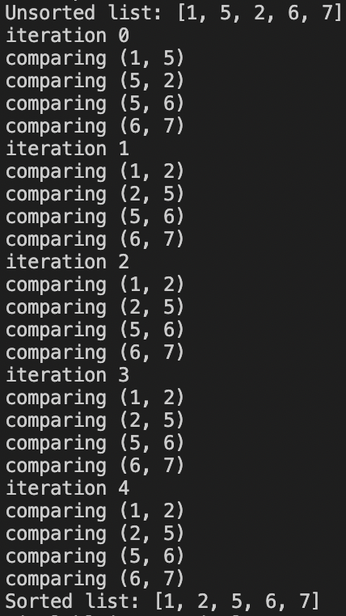
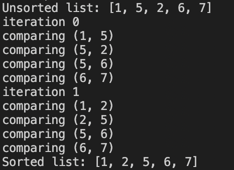

# Activity: Bubble Sort

In this activity, you will implement the bubble sort algorithm in Python. Note that the implementation of the sorting algorithm in this lesson will focus on sorting lists in ascending order.

## Instructions

Write the bubble sort algorithm in [Activity_1_Bubble_Sort.py](Activity_1_Bubble_Sort.py).

## Sorting Algorithm: Bubble Sort

Bubble sort repeatedly swaps adjacent elements if they are not in the correct order.

Write a bubble sort algorithm.

- Define a function named bubble_sort that takes in a list, list, as a parameter.
- Write a FOR loop to run the bubble sort algorithm as many times as there are elements in the list (one less than the length of the list). This will be the outer loop.
- Write a FOR loop to compare all the values in the list for each pass. This is the inner loop.

```python
def bubble_sort(list):
    for i in range(len(list)-1):
        for j in range(len(list) - 1):
```

- Write a conditional statement in the inner loop that checks if the element on the left is greater than the element on the right. If it is, switch the order of the elements.
- Return the value of the list after it has been sorted.

```python
def bubble_sort(list):
    for i in range(len(list)-1):
        for j in range(len(list) - 1):
            if list[j] > list[j+1]:
                list[j], list[j+1] = list[j+1], list[j]

    return list
```

Test the algorithm! Here is sample code to test the function:

```python
sample_list = [1, 5, 2, 6, 7]
print(f"Unsorted list: {sample_list}")
bubble_sort(sample_list)
print(f"Sorted list: {sample_list}")
```

The output would look something like this:

```text
Unsorted list: [1, 5, 2, 6, 7]
Sorted list: [ 1, 2, 5, 6, 7]
```

To see what the bubble sort algorithm is doing, use the print() function to show what is currently happening in each iteration of the outer and inner loop. Print each iteration of the outer loop and each comparison for the inner loop.

```python
def bubble_sort(list):

    for i in range(len(list)):
        print(f"iteration ")
        for j in range(len(list) - 1):
            print(f"comparing {list[j], list[j+1]}")
            if list[j] > list[j+1]:
                list[j], list[j+1] = list[j+1], list[j]

return list
```

We should see something like this in the terminal:



In the sample list shown, only the 5 and 2 had to be swapped in order for the list to be sorted. However, the algorithm we wrote will compare every item in the list against each other regardless of whether the list is sorted. We see this in the iterations where the list is already sorted, such as iterations 2, 3, or 4. We discussed how the bubble sort algorithm is inefficient, but we can make an improvement to our algorithm. What could we improve?

We can improve this algorithm so that when the list is passed through without making any swaps, the algorithm will stop. This is because the list is sorted when it is passed through without any swaps.

Complete the following to add this optimization to the algorithm:

- Create a variable called swapped and set equal to `False`. Declare this variable inside of the outer loop and before the first `print()` function. We will use this variable to determine if items in the list have been swapped. In other words, we will use this variable to determine if the elements are swapped in the pass through the list. If they are not, then the list is sorted and we want the function to stop.
- Set `swapped` equal to `True` if elements were swapped during a pass of the inner loop. In other words, if a swap occurs, set the variable equal to `True`.
Add a conditional statement in the outer `FOR` loop and below the inner `FOR` loop. The conditional statement should check if `swapped` is `False` and if it is, return. In other words, if elements have not been `swapped` in the iteration of the outer loop, return.

Possible solution:

```python
def bubble_sort(list):

for i in range(len(list)):
        swapped = False
        print(f"iteration ")
        for j in range(len(list) - 1):
            print(f"comparing {list[j], list[j+1]}")
            if list[j] > list[j+1]:
                list[j], list[j+1] = list[j+1], list[j]
                swapped = True

        if not swapped:
            return

    return list
```

If we run our function, we should see something like this in the terminal:



We can see that the additional iterations through the sorted list are not there due to the optimization we added. Now that we have seen how this works, we can remove or comment out the print() functions. To review, answer the following question:

### Bubble Sort

Which of the following is not accurate concerning a bubble sort algorithm?

- It is inefficient.
- It compares elements in pairs and swaps elements until larger elements bubble up to the end of the list.
- Smaller elements stay at the bottom or the list.
- The time complexity is quadratic, O(n^2).
- The time complexity is logarithmic, log(n).

## Summary

Nice job. You just wrote your first sorting algorithm, bubble sort. In the next lesson, you will learn about other sorting algorithms and the Python built-in sort functions.

If stuck, you can check out [the bubble sort algorithm here](https://github.com/HackerUSA-CE/PY-Bubble-Sort/tree/solution).

## Bonus

Read about more sorting algorithms:

- [Selection sort](https://en.wikipedia.org/wiki/Selection_sort)
- [Insertion sort](https://en.wikipedia.org/wiki/Insertion_sort)
- [Merge sort](https://en.wikipedia.org/wiki/Merge_sort)
